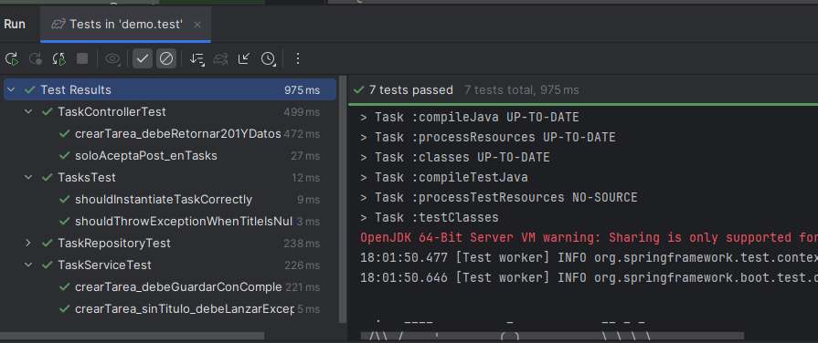

# Reto Técnico: Creación de Tareas con Pruebas TDD y BDD

## Descripción

API REST para gestionar tareas, desarrollada con Java 17 y Spring Boot 3.x. Permite crear tareas con título, descripción y estado, almacenándolas en una base de datos en memoria H2.

El desarrollo sigue un enfoque **TDD (Test Driven Development)** para la lógica de negocio y **BDD (Behavior Driven Development)** para validar el comportamiento del endpoint.

---

## Tecnologías usadas

- Java 17
- Spring Boot 3.x
- Gradle
- Base de datos en memoria H2
- JUnit 5
- Mockito
- Spring Data JPA
- MockMvc para pruebas de integración y BDD

---

## Arquitectura

Se implementó el patrón MVC con las siguientes capas:

- **Modelo:** Entidad `Task` con campos `id`, `title`, `description` y `completed`.
- **Repositorio:** Interface `TaskRepository` que extiende `JpaRepository`.
- **Servicio:** `TaskService` con lógica de negocio para validar y guardar tareas.
- **Controlador:** `TaskController` con endpoint REST `/tasks` que acepta solo POST.

---

## Funcionalidades

- Crear una tarea con título y descripción obligatorios.
- El campo `completed` inicia en `false` por defecto.
- Persistencia de tareas en base de datos H2 en memoria.
- Endpoint `/tasks` que acepta solo peticiones POST.
- Respuesta JSON con ID, título, descripción y estado.

---

## Cómo ejecutar el proyecto

1. Clonar el repositorio

bash
git clone <url-del-repositorio>
cd nombre-del-proyecto


POST /tasks
Content-Type: application/json

{
  "title": "Comprar leche",
  "description": "Ir al supermercado y comprar leche"
}
```


